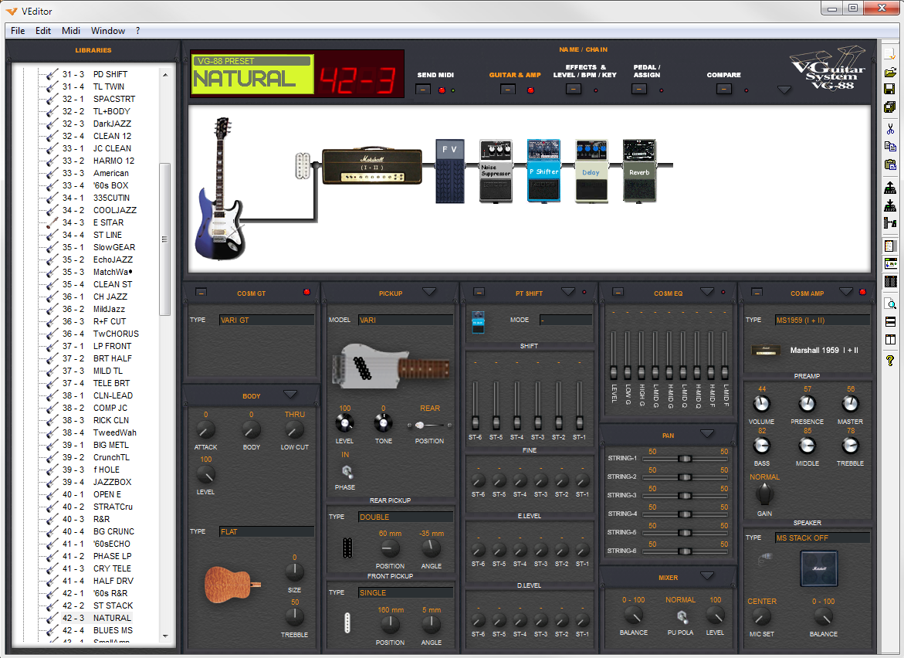

# V-editor
V-Editor is a graphical editor for VG-88 guitar system

This is an old project (2003). The editor was used by a lot of users for free but the source had never been published.

This video show the editor in action
https://www.youtube.com/watch?time_continue=33&v=XFz24YOxSso&feature=emb_logo

